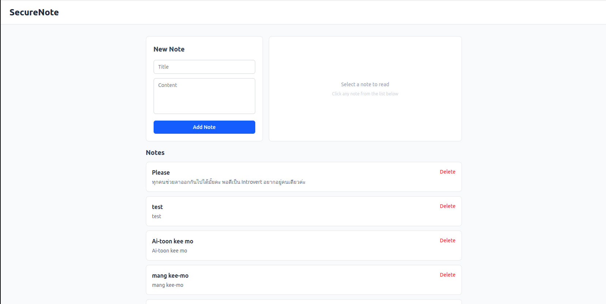

# Secure Note App

A full-stack web application for creating, viewing, and deleting secure notes with client-server separation and environment-based configuration.




## Table of Contents

- [Live Deployment](#live-deployment)
- [Project Structure](#project-structure)
- [Quick Start](#quick-start)
- [Frontend](#frontend)
- [Backend](#backend)
- [API Endpoints](#api-endpoints)

---

## Live Deployment

**App is deployed and live on the cloud:**

| Component | URL | Host |
|-----------|-----|------|
| **Frontend** | https://secure-note-app-sigma.vercel.app | Vercel |
| **Backend API** | https://secure-note-app-api.up.railway.app | Railway |

**Deployment Info:**
- Frontend deployed on **Vercel** (auto HTTPS)
- Backend deployed on **Railway** (auto HTTPS)
- Both services on free tier

---

## Project Structure

```
/secure-note-app
  /backend          # Node.js + Express server
  /frontend         # React + Vite + Tailwind CSS
  REPORT.md         # Conceptual report
  README.md         # This file
```

---

## Frontend

### Installation
```bash
cd frontend
npm install
```

### Configuration
No environment variables required. API URL and `SECRET_TOKEN` are hardcoded in `src/data/api.js`. Update if you change backend PORT or SECRET_TOKEN.

### Development
```bash
npm run dev        # Frontend starts on http://localhost:5173
```

### Production Build
```bash
npm run build
```

### Architecture

```
src/
  components/           # Reusable UI components
    NoteForm.jsx       # Form to create notes
    NoteDetail.jsx     # Panel to view selected note
    NoteList.jsx       # List of all notes
  pages/
    NotesPage.jsx      # Main page (assembles components)
  data/
    api.js             # Fetch functions for backend API
    useNotes.js        # Custom hook for state management
  App.jsx              # Router + layout
  main.jsx             # Entry point
  index.css            # Tailwind + custom classes
```

---

## Backend

### Installation
```bash
cd backend
npm install
```

### Configuration

Create `.env` file:
```env
PORT=3000
SECRET_TOKEN=your_secret_here
```

**Optional — PocketHost (cloud storage):**
Add in same `.env`:

```env
POCKETHOST_URL=https://your-instance.pockethost.io
POCKETHOST_USER_ID=1
POCKETHOST_TOKEN=your_token
```

If `POCKETHOST_URL` is set → uses PocketHost, otherwise uses local `notes.json`

### Run
```bash
node server.js
```
Server starts on `http://localhost:3000`

### Architecture

```
backend/
  server.js         # Main Express app, routes, middleware
  notes.json        # Local notes storage (auto-created)
  .env              # Environment variables (not committed)
  package.json
```

**Key Features:**
- Single entry point: `server.js`
- Auto-detects storage mode from `.env` (local JSON or PocketHost)
- `requireAuth` middleware for POST/DELETE endpoints
- CORS enabled for frontend requests

---

## API Endpoints

| Method | Path | Auth | Description |
|--------|------|------|-------------|
| GET | `/api/notes` | No | Get all notes |
| POST | `/api/notes` | Yes | Create note: `{ title, content }` |
| DELETE | `/api/notes/:id` | Yes | Delete note by ID |

**Authorization Header:** `Authorization: your_secret_here` (required for POST/DELETE)

**Example:**
```bash
curl -X POST http://localhost:3000/api/notes \
  -H "Authorization: your_secret_here" \
  -H "Content-Type: application/json" \
  -d '{"title":"My Note","content":"Note content"}'
```
